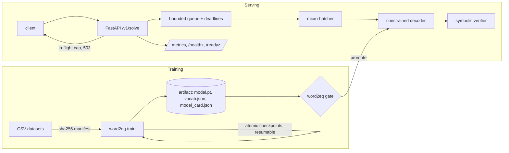

# Word2Eq

Word2Eq translates math word problems into equations and verifies the answer. It includes a
reproducible training pipeline and a micro-batched, SLO-instrumented inference service.

```
"Paco had 26 cookies. He ate 9 of them. How many cookies are left?"
   → {"equation": "26 - 9", "equation_prefix": ["-", "number0", "number1"], "answer": 17.0, "verified": true}
```

The model is a seq2seq Transformer. It translates a problem, with its numbers masked as
`number0..numberK`, into a prefix-notation equation. Decoding is constrained to the equation
grammar, so every output is well-formed, and every answer is computed and checked symbolically
before the service returns it.

## Architecture



| Concern | How it's handled | Where |
|---|---|---|
| Valid outputs | Pushdown-automaton grammar mask on the logits: no malformed equations, no references to absent numbers | [decoding.py](word2eq/decoding.py) |
| Reproducibility | Seeded and deterministic kernels; content-hashed data split; batch order derived from `(seed, epoch)` | [train.py](word2eq/train.py) |
| Preemption | SIGTERM checkpoints atomically mid-epoch; `--resume` produces bit-identical weights (tested) | [train.py](word2eq/train.py), [test_train.py](tests/test_train.py) |
| Lineage | Model card records config fingerprint, data SHA-256s, git SHA and metrics; weights load with `weights_only=True`, vocab is JSON | [artifact.py](word2eq/artifact.py) |
| Throughput | Async dynamic micro-batching (max batch / max wait) on a dedicated inference thread | [batcher.py](word2eq/serving/batcher.py) |
| Overload | Edge in-flight cap, bounded queue (fast 503 + Retry-After), deadline propagation, batch-level fault isolation, graceful drain | [app.py](word2eq/serving/app.py), [batcher.py](word2eq/serving/batcher.py) |
| Observability | Prometheus metrics for latency, queue wait, batch size, shed reasons and unverified answers; burn-rate alerts; runbook | [metrics.py](word2eq/serving/metrics.py), [alerts.yml](deploy/prometheus/alerts.yml), [RUNBOOK](docs/RUNBOOK.md) |
| Release safety | CI trains a smoke model and runs the promotion gate (accuracy drop and validity checks) | [ci.yml](.github/workflows/ci.yml), `word2eq gate` |

## Results

The test set is the 1,000 SVAMP problems; training uses MAWPS + ASDiv-A. Model selection uses a
10% held-out split of the training data, never the test set.

| Model | Params | SVAMP answer acc | Valid equations (unconstrained → constrained) | Offline eval throughput |
|---|---|---|---|---|
| `configs/base.yaml` | 6.4M | 16.4% | 97.4% → **100%** | 638 /s |
| `configs/small.yaml` | 1.4M | 15.6% | 94.0% → **100%** | 2,422 /s |

In-distribution validation accuracy is 73%. SVAMP is an adversarial challenge set, and the
original paper reports about 20% for a vanilla Transformer. This project's focus is the
system around the model, not the leaderboard.

Serving capacity and its open issues are in [docs/SLO.md](docs/SLO.md#capacity).

## Usage

```bash
pip install torch --index-url https://download.pytorch.org/whl/cpu
pip install -e ".[dev]"

word2eq train --config configs/base.yaml              # Ctrl-C / SIGTERM is safe; add --resume to continue
word2eq eval  --artifact runs/base/artifact --data data/mawps-asdiv-a_svamp/dev.csv
word2eq gate  --candidate runs/base/metrics.json --baseline baselines/svamp.json
word2eq cv    --dataset data/cv_asdiv-a               # 5-fold cross-validation
word2eq bench --artifact runs/base/artifact           # fp32 vs int8, batch-size sweep
word2eq serve --artifact runs/base/artifact --port 8000

python scripts/loadtest.py --url http://localhost:8000 --rps 50 150 --duration 20
pytest
```

Container and Kubernetes: see [Dockerfile](Dockerfile) and [deploy/k8s/word2eq.yaml](deploy/k8s/word2eq.yaml).
The manifest sets probes, a PDB, an HPA, zone spread and a zero-downtime rollout.

## Data

`data/` holds the SVAMP benchmark splits from Patel et al., *Are NLP Models really able to Solve
Simple Math Word Problems?* (NAACL 2021): MAWPS, ASDiv-A, SVAMP and their cross-validation folds.
